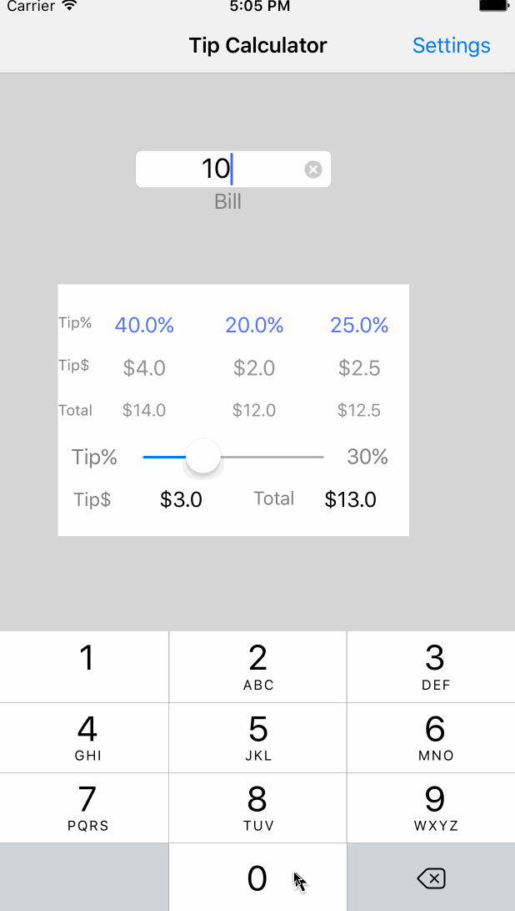

# *Tip Calculator*

**Tip Calculator** is a tip calculator application for iOS.

Submitted by: **Mohamed Ayadi**

Time spent: **3** hour spent in total

## User Stories

The following **required** functionality is complete:

* [x] User can enter a bill amount, choose a tip percentage, and see the tip and total values.
* [x] Settings page to change the default tip percentage.

The following **optional** features are implemented:
* [x] UI animations
* [x] Remembering the bill amount across app restarts (if <10mins)
* [x] Currency thousands separators.
* [x] Making sure the keyboard is always visible and the bill amount is always the first responder. This way the user doesn't have to tap anywhere to use this app. Just launch the app and start typing.

## Video Walkthrough 

Here's a walkthrough of implemented user stories:

GIF created with [LiceCap](http://www.cockos.com/licecap/).

## Project Analysis

**Question 1**: "How would you describe outlets and actions to another developer? Bonus: any idea how they are being implemented under the hood? (It might give you some ideas if you right-click on the Storyboard and click Open As->Source Code")

**Answer:** [IBOUTLET allows you to change properties of a control while the action is used for an event to trigger code basically do something. So you would only use an IBOUTLET when you wanted to change the way something looked i.e the Label you use an outlet since you want to change it's text property you could change it's size, colour, font etc but you would need to turn this into an outlet before you could do this on the other hand you would use an action when you want something to be triggered when the user presses something which in this case is changing the text in the label when you press the button you are using the action to activate a trigger event what this then does is it uses the IBOUTLET you declared before and changes the text property with the value returned from the method.]

## License

    Copyright [2017] [Mohamed Ayadi]

    Licensed under the Apache License, Version 2.0 (the "License");
    you may not use this file except in compliance with the License.
    You may obtain a copy of the License at

        http://www.apache.org/licenses/LICENSE-2.0

    Unless required by applicable law or agreed to in writing, software
    distributed under the License is distributed on an "AS IS" BASIS,
    WITHOUT WARRANTIES OR CONDITIONS OF ANY KIND, either express or implied.
    See the License for the specific language governing permissions and
    limitations under the License.
